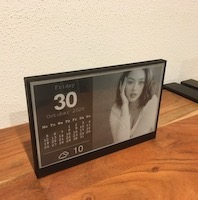
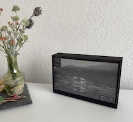
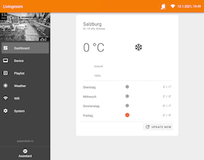

[]()
[](https://app.swaggerhub.com/apis-docs/paperdash.io/paperdash-epd/0.1)
[]()
[]()
[](https://www.thingiverse.com/thing:4724292)
[](https://madewithvuejs.com/p/paperdash/shield-link)


## Open Source E-Paper Display Platform

* 🌍 [Website](https://paperdash.io/) - Learn more about paperdash.io
* 📡 [Discover](http://local.paperdash.io/) - Find devices in your local network
* 🛠 [Case](https://www.thingiverse.com/thing:4724292) - 3D Model
* 👍 Like us on [Instagram](https://instagram.com/paperdash.io)






## Goals
* Make E-Paper displays accessible to all kind of developers
* Easy and always update able
* Usable also without developer background
* Deliver the best user experience
* Should work `Out-of-the-box`
* Using standard parts to built

## Features

### Firmware
* OTA update
* [REST API](https://app.swaggerhub.com/apis-docs/paperdash.io/paperdash-epd/0.1)
* JPEG decoder (some limitations)
* PNG decoder (work in progress)
* Out-of-the-box faces
  * Current weather condition and forecast (https://openweathermap.org/ api key requried)
  * Calendar view with random picture
  * Today view with fullscreen random picture
* Wifi STA fallback if connection failed

### Web APP
* ESP-32 optimized vue.js Web APP
* [Material Design Framework](https://vuetifyjs.com/)
* First run setup wizard
* Screen preview of epd
* Basic PWA possibility


## API examples

```bash
# Get device stats as json
$ curl http://paperdash-epd.local/stats

# Download current image display
$ curl http://paperdash-epd.local/api/device/screen > current.bmp

# Send an image to display
$ curl -F '=@data/faceToday.jpg;filename=dithering' http://paperdash-epd.local/api/device/screen
```

# Getting started

## Necessary parts to build the project

* [Microcontroller ESP32](https://www.espressif.com/sites/default/files/documentation/esp32_datasheet_en.pdf)
* [E-Paper Display GDEW075T8](https://www.waveshare.com/wiki/7.5inch_e-Paper_HAT)
* [Case](https://www.thingiverse.com/thing:4724292)

## ESP-32 firmware

> The whole architecture was inspired from the arduino concept with a setup() and loop() function.
> This is the reason why everything is broken down into separate modules below `/lib`. Each module has basically a `setupXXX()` and `loopXXX()` method.

### Build (with PlatformIO)
```bash
$ pio run --environment esp32

# update esp
$ platformio run --target upload
```

## Web APP

> Based on state of the art technologie [Vue.js](https://vuejs.org/) + [Vuetify](https://vuetifyjs.com/) + [Webpack](https://webpack.js.org/)

### Build
```bash
$ yarn --cwd app
$ yarn --cwd app build

# update esp
$ platformio run --target uploadfs

# alternative, create spiffs.bin
$ platformio run --target buildfs
```
